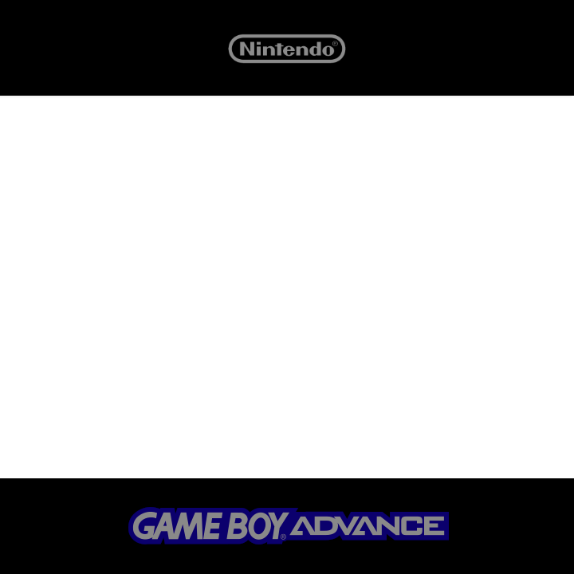
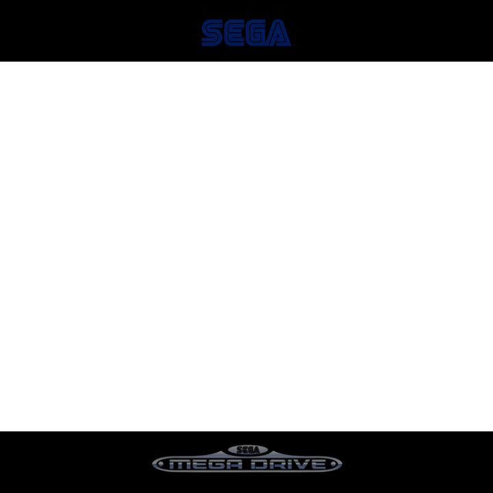

# Powkiddy RGB30 bezels

Set of RGB30 bezels. Based on @fabiodotcom set.

<table>
    <tr>
        <td></td>
        <td></td>
    </tr>
        <tr>
        <td></td>
        <td></td>
    </tr>
        <tr>
        <td></td>
        <td></td>
    </tr>
        <tr>
        <td></td>
        <td></td>
    </tr>
        <tr>
        <td></td>
    </tr>
</table>

## Setup

To set up overlays, download "bezels" catalog and then add the files to the “bezels” folder of your SD2 card. Then, open a game and press the SELECT + X button to bring up the RetroArch Quick Menu. Navigate to On-Screen Overlay > Display Overlay > ON, then go to Overlay Preset and navigate to the roms folder (you’ll need to select “Parent Directory” twice before it appears). Then go to roms > bezels and find the cfg file for your desired overlay. You can now back out to your game and see if you like the way it looks. If you are satisfied, go into the Quick Menu > Overrides > Save Content Directory Overrides so that all future games from that system will use that overlay.

## Links

[Retro Game Corps RGB30 Starter Guide](https://retrogamecorps.com/2023/10/27/powkiddy-rgb30-starter-guide/#Accessories)
